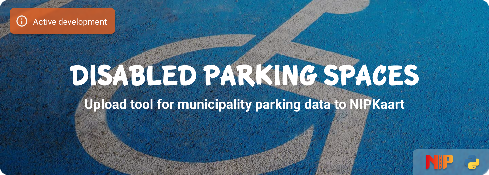

<!--
*** To avoid retyping too much info. Do a search and replace for the following:
*** github_username, repo_name
-->

<!-- Banner -->


<!-- PROJECT SHIELDS -->
[![GitHub Activity][commits-shield]][commits]
[![GitHub Last Commit][last-commit-shield]][commits]
[![Linting][linting-shield]][linting-url]

![Project Maintenance][maintenance-shield]
[![License][license-shield]](LICENSE.md)
[![Contributors][contributors-shield]][contributors-url]

[![Forks][forks-shield]][forks-url]
[![Stargazers][stars-shield]][stars-url]
[![Issues][issues-shield]][issues-url]

## About

This project makes it possible to download and upload parking data from municipalities to the [NIPkaart][nipkaart] platform. If the data is regularly updated, it is possible to automate this with a docker container.

## Supported cities

These are the cities currently supported:

| Country | City | Locations | Update frequency | Crontab |
|:--------|:-----|:----------|:-----------------| :-------|
| Belgium | Brussel | 877 |  |
| Belgium | Liege | 952 |  |
| Belgium | Namur | 305 |  |
| Germany | Dresden | 477 |  |
| Germany | Dusseldorf | 315 |  |
| Germany | Hamburg | 671 |  |
| Netherlands | Amersfoort | 149 | every monday at 03:00 | `0 3 * * 1` |
| Netherlands | Amsterdam | 1251 | every second day of the month at 03:00 | `0 3 2 * *` |
| Netherlands | Arnhem | 121 |  |
| Netherlands | Den Haag | 234 (says 241) | every second day of the month at 02:30 | `30 2 2 * *` |
| Netherlands | Eindhoven | 180 | every second day of the month at 03:00 | `0 3 2 * *` |
| Netherlands | Groningen | 187 |  |
| Netherlands | Zoetermeer | 388 |  |


## Development
<details>
  <summary>Click to expand!</summary>

1. Create a `.env` file
```bash
cp .env.example .env
```
2. Fillout the database credentials and which city you want to upload
3. Create your virtual environment
```bash
python3 -m venv venv
source venv/bin/activate
```
4. Install dependencies
```bash
pip install -r requirements.txt
```

### Build image

```bash
docker build -t parking-[CITY] .
```

### Run the image

```bash
docker run parking-[CITY] -d --restart on-failure --name nipkaart-parking-[CITY]
```

or

```bash
docker stack deploy -c deploy/[CITY].yml parking
```

### Use of pre-commit

This project provides the option to use pre-commit, so that each commit is checked for code review before being pushed through.

Within your virtual environment you can use this command to install it:

```bash
pre-commit install
```

If you want to perform a full check in the meantime:

```bash
pre-commit run --all-files
```

### Crontab

Certain datasets are regularly updated, so that we can update them automatically in the NIPKaart database.

`0 3 1 * *` = Run every first day of the month at 03:00<br>
`30 2 2 * *` = Run every second day of the month at 02:30<br>
`0 3 2 * *` = Run every second day of the month at 03:00<br>
`0 3 * * 1` = Run every monday at 03:00<br>
`30 2 * * 1` = Run every monday at 02:30<br>
`0 3 * * 2` = Run every thuesday at 03:00<br>
`*/2 * * * *` = Run every 2 minutes<br>

Crontab generator: https://crontab.guru

</details>

## Contributing

Would you like to contribute to the development of this project? Then read the prepared [contribution guidelines](CONTRIBUTING.md) and go ahead!

Thank you for being involved! :heart_eyes:

## License

MIT License

Copyright (c) 2021-2023 Klaas Schoute

Permission is hereby granted, free of charge, to any person obtaining a copy
of this software and associated documentation files (the "Software"), to deal
in the Software without restriction, including without limitation the rights
to use, copy, modify, merge, publish, distribute, sublicense, and/or sell
copies of the Software, and to permit persons to whom the Software is
furnished to do so, subject to the following conditions:

The above copyright notice and this permission notice shall be included in all
copies or substantial portions of the Software.

THE SOFTWARE IS PROVIDED "AS IS", WITHOUT WARRANTY OF ANY KIND, EXPRESS OR
IMPLIED, INCLUDING BUT NOT LIMITED TO THE WARRANTIES OF MERCHANTABILITY,
FITNESS FOR A PARTICULAR PURPOSE AND NONINFRINGEMENT. IN NO EVENT SHALL THE
AUTHORS OR COPYRIGHT HOLDERS BE LIABLE FOR ANY CLAIM, DAMAGES OR OTHER
LIABILITY, WHETHER IN AN ACTION OF CONTRACT, TORT OR OTHERWISE, ARISING FROM,
OUT OF OR IN CONNECTION WITH THE SOFTWARE OR THE USE OR OTHER DEALINGS IN THE
SOFTWARE.

[nipkaart]: https://nipkaart.nl

<!-- MARKDOWN LINKS & IMAGES -->
[maintenance-shield]: https://img.shields.io/maintenance/yes/2023.svg
[contributors-shield]: https://img.shields.io/github/contributors/nipkaart/disabled-parking.svg
[contributors-url]: https://github.com/nipkaart/disabled-parking/graphs/contributors
[forks-shield]: https://img.shields.io/github/forks/nipkaart/disabled-parking.svg
[forks-url]: https://github.com/nipkaart/disabled-parking/network/members
[stars-shield]: https://img.shields.io/github/stars/nipkaart/disabled-parking.svg
[stars-url]: https://github.com/nipkaart/disabled-parking/stargazers
[issues-shield]: https://img.shields.io/github/issues/nipkaart/disabled-parking.svg
[issues-url]: https://github.com/nipkaart/disabled-parking/issues
[license-shield]: https://img.shields.io/github/license/nipkaart/disabled-parking.svg
[commits-shield]: https://img.shields.io/github/commit-activity/y/nipkaart/disabled-parking.svg
[commits]: https://github.com/nipkaart/disabled-parking/commits/main
[last-commit-shield]: https://img.shields.io/github/last-commit/nipkaart/disabled-parking.svg
[linting-shield]: https://github.com/nipkaart/disabled-parking/actions/workflows/linting.yml/badge.svg
[linting-url]: https://github.com/nipkaart/disabled-parking/actions/workflows/linting.yml
