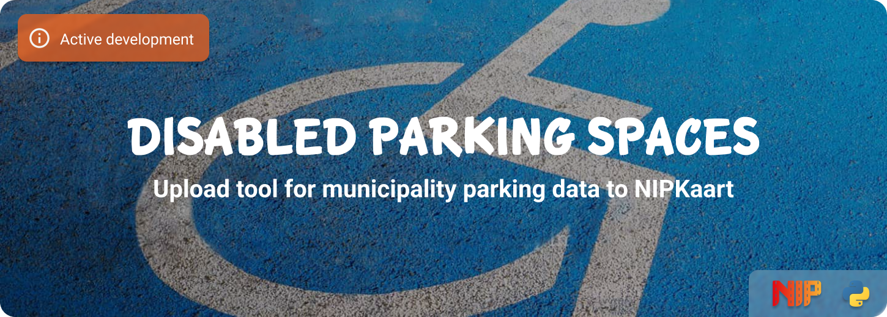

<!--
*** To avoid retyping too much info. Do a search and replace for the following:
*** github_username, repo_name
-->

<!-- Banner -->


<!-- PROJECT SHIELDS -->
[![GitHub Activity][commits-shield]][commits]
[![GitHub Last Commit][last-commit-shield]][commits]
[![Linting][linting-shield]][linting-url]

![Project Maintenance][maintenance-shield]
[![License][license-shield]](LICENSE.md)
[![Contributors][contributors-shield]][contributors-url]

[![Forks][forks-shield]][forks-url]
[![Stargazers][stars-shield]][stars-url]
[![Issues][issues-shield]][issues-url]

## About

This project normalizes municipal disabled parking data into local review files for [NIPKaart][nipkaart]. Universal Python packages parse source data; municipality adapters map it to shared records.

## Local draft export

The existing municipality adapters expose `normalize(item) -> MunicipalRecord`. This pure mapping accepts the existing package models (or the four direct JSON sources) and does not open a database connection. `write_records(city, records, output)` writes these records to a local JSON file. The universal packages remain independent of NIPKaart.

To try the complete offline path through a package's parser, adapter and file writer:

```bash
uv sync --locked
uv run --locked python export.py --city hamburg --input tests/fixtures/hamburg.json --output /tmp/hamburg-draft.json
uv run --locked python -m unittest discover -s tests -v
```

No `.env` or database credentials are needed for this path. `--input` is a captured response in the municipality's existing response shape. This command does not fetch or paginate a live API. The fixture example contains two sample rows.

The draft contains source context and records with a full package identifier (`external_id`), coordinates, nullable capacity, address/orientation where available, source dates and selected additional package attributes. Unknown capacity remains `null`, zero remains zero, and import time is not substituted for a missing source date. Polygon points retain the existing vertex-average calculation, explicitly named `vertex_average`. Amersfoort still uses a coordinate-derived identity, identified as `coordinate_hash`.

The envelope has `exported_at`, `record_count`, `retrieved_at: null` and `complete: null`. Neither source retrieval time nor completeness can be inferred from a captured response. There is no publication flag or core database ID. This is a provisional review format, not a released core ingestion contract or evidence that the data may be published. Unknown pagination, source classification, source licenses and fields not exposed by the packages still need source-specific acceptance. The fixtures and their provenance are documented in [tests/fixtures/README.md](tests/fixtures/README.md).

Malformed records, duplicate source IDs or limits above 10,000 records / 32 MiB fail the export. Output is replaced atomically only on success; a failed export leaves an existing output file intact. The limits are local operational guards, not a final platform contract. The captured-response path also rejects known lossy capacity parsing in Amsterdam and Düsseldorf instead of silently truncating values. Other upstream transformations are still the responsibility of the source packages.

The database importer, SQL upload methods, database compatibility IDs and scheduled deployment configuration have been removed. Source-fetch helpers remain available independently, but the CLI consumes captured responses only. Live-fetch orchestration, pagination/completeness verification and core intake remain follow-up work.

## Supported mappings

- Belgium: Antwerpen, Brussel, Liège and Namur.
- Germany: Dresden, Düsseldorf, Hamburg and Köln.
- Netherlands: Amersfoort, Amsterdam, Arnhem, Den Haag, Eindhoven, Groningen and Zoetermeer.

## Development

This project uses [uv][uv] and Python 3.11+. Install [uv][uv-install], then install the locked application, municipality and development dependencies:

```bash
uv sync --locked
uv run --locked pre-commit install
uv run --locked python -m unittest discover -s tests -v
uv run --locked pre-commit run --all-files
```

`uv run` uses the project's `.venv`; activating a shell is optional. The `cities` and `dev` dependency groups are installed by default. Use `uv sync --locked --no-dev` for runtime dependencies, including all municipality packages. CI and Docker use the committed `uv.lock`. Run `uv lock` after intentional dependency changes and commit both files.

The optional `.env.example` contains source endpoint settings used by the direct-source download helpers. The local export requires no `.env` or database credentials.

## Container

Build and run the offline export with an input fixture and a writable output directory:

```bash
docker build -t disabled-parking .
mkdir -p output
docker run --rm --network none \
  -v "$PWD/tests/fixtures:/input:ro" \
  -v "$PWD/output:/output" \
  disabled-parking --city hamburg --input /input/hamburg.json --output /output/hamburg.json
```

Running the image without arguments shows CLI help. The container runs once and exits; it no longer starts cron or writes directly to a database.

## Contributing

Would you like to contribute to the development of this project? Then read the prepared [contribution guidelines](CONTRIBUTING.md) and go ahead!

Thank you for being involved! :heart_eyes:

## License

MIT License

Copyright (c) 2021-2024 Klaas Schoute

Permission is hereby granted, free of charge, to any person obtaining a copy
of this software and associated documentation files (the "Software"), to deal
in the Software without restriction, including without limitation the rights
to use, copy, modify, merge, publish, distribute, sublicense, and/or sell
copies of the Software, and to permit persons to whom the Software is
furnished to do so, subject to the following conditions:

The above copyright notice and this permission notice shall be included in all
copies or substantial portions of the Software.

THE SOFTWARE IS PROVIDED "AS IS", WITHOUT WARRANTY OF ANY KIND, EXPRESS OR
IMPLIED, INCLUDING BUT NOT LIMITED TO THE WARRANTIES OF MERCHANTABILITY,
FITNESS FOR A PARTICULAR PURPOSE AND NONINFRINGEMENT. IN NO EVENT SHALL THE
AUTHORS OR COPYRIGHT HOLDERS BE LIABLE FOR ANY CLAIM, DAMAGES OR OTHER
LIABILITY, WHETHER IN AN ACTION OF CONTRACT, TORT OR OTHERWISE, ARISING FROM,
OUT OF OR IN CONNECTION WITH THE SOFTWARE OR THE USE OR OTHER DEALINGS IN THE
SOFTWARE.

[nipkaart]: https://nipkaart.nl

<!-- MARKDOWN LINKS & IMAGES -->
[maintenance-shield]: https://img.shields.io/maintenance/yes/2024.svg
[contributors-shield]: https://img.shields.io/github/contributors/nipkaart/disabled-parking.svg
[contributors-url]: https://github.com/nipkaart/disabled-parking/graphs/contributors
[forks-shield]: https://img.shields.io/github/forks/nipkaart/disabled-parking.svg
[forks-url]: https://github.com/nipkaart/disabled-parking/network/members
[stars-shield]: https://img.shields.io/github/stars/nipkaart/disabled-parking.svg
[stars-url]: https://github.com/nipkaart/disabled-parking/stargazers
[issues-shield]: https://img.shields.io/github/issues/nipkaart/disabled-parking.svg
[issues-url]: https://github.com/nipkaart/disabled-parking/issues
[license-shield]: https://img.shields.io/github/license/nipkaart/disabled-parking.svg
[commits-shield]: https://img.shields.io/github/commit-activity/y/nipkaart/disabled-parking.svg
[commits]: https://github.com/nipkaart/disabled-parking/commits/main
[last-commit-shield]: https://img.shields.io/github/last-commit/nipkaart/disabled-parking.svg
[linting-shield]: https://github.com/nipkaart/disabled-parking/actions/workflows/linting.yaml/badge.svg
[linting-url]: https://github.com/nipkaart/disabled-parking/actions/workflows/linting.yaml

[uv-install]: https://docs.astral.sh/uv/getting-started/installation/
[uv]: https://docs.astral.sh/uv/
[pre-commit]: https://pre-commit.com
