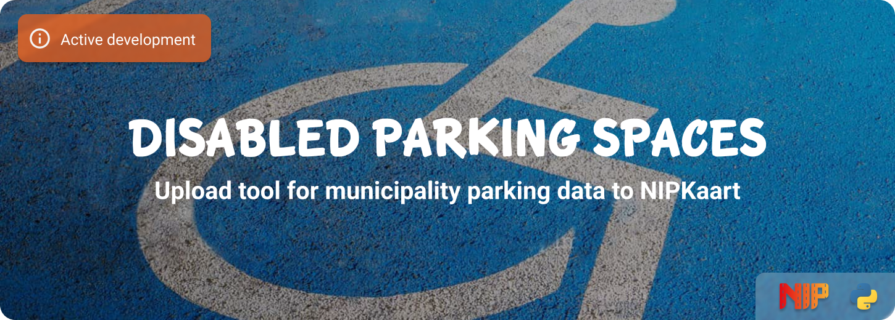

<!--
*** To avoid retyping too much info. Do a search and replace for the following:
*** github_username, repo_name
-->

<!-- Banner -->


<!-- PROJECT SHIELDS -->
[![GitHub Activity][commits-shield]][commits]
[![GitHub Last Commit][last-commit-shield]][commits]
[![Linting][linting-shield]][linting-url]

![Project Maintenance][maintenance-shield]
[![License][license-shield]](LICENSE.md)
[![Contributors][contributors-shield]][contributors-url]

[![Forks][forks-shield]][forks-url]
[![Stargazers][stars-shield]][stars-url]
[![Issues][issues-shield]][issues-url]

Collect municipal accessible-parking data for [NIPKaart](https://nipkaart.nl). One container collects Amsterdam (`nl-amsterdam`) and Eindhoven (`nl-eindhoven`) and uploads complete deliveries to private Cloudflare R2 for review in core.

## Run

Copy `.env.example` to `.env`, fill in the private R2 bucket endpoint and credentials, then start:

```bash
chmod 600 .env
docker compose up -d --build
docker compose logs --tail 100 -f collector
```

Each dataset runs daily and retries failures independently. Set `COLLECTOR_INTERVAL_SECONDS` to change the interval. Keep the data volume during updates: **do not use `docker compose down -v`**, which deletes pending deliveries.

## Retention

Deliveries go to the private EU bucket `nipkaart-imports` under `municipal/<dataset>/`. Core also archives manual uploads there. Set one lifecycle rule on the bucket, once:

| Rule name | Prefix | Delete after | Why |
| --- | --- | --- | --- |
| `expire-municipal` | `municipal/` | 30 days | Well beyond the 7-day core outage window; covers every dataset |

Never add a rule without a prefix: the bucket also holds offstreet deliveries with their own rules (see [offstreet-parking](https://github.com/NIPKaart/offstreet-parking#retention)).

**Dashboard:** R2 → `nipkaart-imports` → Settings → Object lifecycle rules → Add rule. Enter the name and prefix, choose to delete objects after 30 days, and save. If an older rule only covers `municipal/nl-amsterdam/`, replace it with this one.

**Or with Wrangler** (after `npx wrangler login`; the bucket is in the EU jurisdiction):

```bash
npx wrangler r2 bucket lifecycle add nipkaart-imports expire-municipal municipal/ --expire-days 30 --jurisdiction eu
npx wrangler r2 bucket lifecycle list nipkaart-imports --jurisdiction eu
```

## Local export

Requires Python 3.14+ and [uv](https://docs.astral.sh/uv/). No R2 credentials needed.

```bash
uv sync --locked
uv run python export.py --city amsterdam --output /tmp/amsterdam.json
uv run python export.py --city eindhoven --output /tmp/eindhoven.json
```

Eindhoven is available for source review only. Publication remains blocked until general access, source-ID stability and data currency are confirmed. Dataset IDs have no legacy aliases or automatic migration.

## Development

Register datasets in [`app/datasets.py`](app/datasets.py). Each source returns a shared `Collection`; the exporter and scheduler use the registry automatically.

```bash
uv run python -m unittest discover -s tests -v
uv run pre-commit run --all-files
```

See the [delivery contract](https://github.com/NIPKaart/core/blob/main/docs/development/data-import-contract.md) for source mappings, core registration and review requirements.

### Delivery format

Deliveries use `nipkaart-municipal-2`. Each file carries a `source` block from the dataset registry in `app/datasets.py`, so core can discover the dataset and an administrator can approve it once ([core ADR 0013](https://github.com/NIPKaart/core/blob/main/docs/adr/0013-discover-dataset-sources-from-deliveries-with-one-time-approval.md)): name, publisher, source URL, SPDX licence (`null` when the source publishes none), terms URL, attribution, ISO country and subdivision with the CBS municipality code, bounds and the expected delivery interval. Every position of every record must lie within the bounds. Changing any of these values makes core ask for approval again, except `expected_interval_hours`.

Records keep the source's own claims in `source_attributes`. Source-specific rules stay in the adapters: Amsterdam delivers only general E6a bays and maps its bay orientation to the neutral `orientation` values `perpendicular`, `parallel` and `angle`; Eindhoven delivers points with `access_category` `unknown` and no orientation.

## Contributing

Would you like to contribute to the development of this project? Then read the prepared [contribution guidelines](CONTRIBUTING.md) and go ahead!

Thank you for being involved! :heart_eyes:

## License

MIT License

Copyright (c) 2021-2024 Klaas Schoute

Permission is hereby granted, free of charge, to any person obtaining a copy
of this software and associated documentation files (the "Software"), to deal
in the Software without restriction, including without limitation the rights
to use, copy, modify, merge, publish, distribute, sublicense, and/or sell
copies of the Software, and to permit persons to whom the Software is
furnished to do so, subject to the following conditions:

The above copyright notice and this permission notice shall be included in all
copies or substantial portions of the Software.

THE SOFTWARE IS PROVIDED "AS IS", WITHOUT WARRANTY OF ANY KIND, EXPRESS OR
IMPLIED, INCLUDING BUT NOT LIMITED TO THE WARRANTIES OF MERCHANTABILITY,
FITNESS FOR A PARTICULAR PURPOSE AND NONINFRINGEMENT. IN NO EVENT SHALL THE
AUTHORS OR COPYRIGHT HOLDERS BE LIABLE FOR ANY CLAIM, DAMAGES OR OTHER
LIABILITY, WHETHER IN AN ACTION OF CONTRACT, TORT OR OTHERWISE, ARISING FROM,
OUT OF OR IN CONNECTION WITH THE SOFTWARE OR THE USE OR OTHER DEALINGS IN THE
SOFTWARE.

[nipkaart]: https://nipkaart.nl

<!-- MARKDOWN LINKS & IMAGES -->
[maintenance-shield]: https://img.shields.io/maintenance/yes/2024.svg
[contributors-shield]: https://img.shields.io/github/contributors/nipkaart/disabled-parking.svg
[contributors-url]: https://github.com/nipkaart/disabled-parking/graphs/contributors
[forks-shield]: https://img.shields.io/github/forks/nipkaart/disabled-parking.svg
[forks-url]: https://github.com/nipkaart/disabled-parking/network/members
[stars-shield]: https://img.shields.io/github/stars/nipkaart/disabled-parking.svg
[stars-url]: https://github.com/nipkaart/disabled-parking/stargazers
[issues-shield]: https://img.shields.io/github/issues/nipkaart/disabled-parking.svg
[issues-url]: https://github.com/nipkaart/disabled-parking/issues
[license-shield]: https://img.shields.io/github/license/nipkaart/disabled-parking.svg
[commits-shield]: https://img.shields.io/github/commit-activity/y/nipkaart/disabled-parking.svg
[commits]: https://github.com/nipkaart/disabled-parking/commits/main
[last-commit-shield]: https://img.shields.io/github/last-commit/nipkaart/disabled-parking.svg
[linting-shield]: https://github.com/nipkaart/disabled-parking/actions/workflows/linting.yaml/badge.svg
[linting-url]: https://github.com/nipkaart/disabled-parking/actions/workflows/linting.yaml

[pre-commit]: https://pre-commit.com
